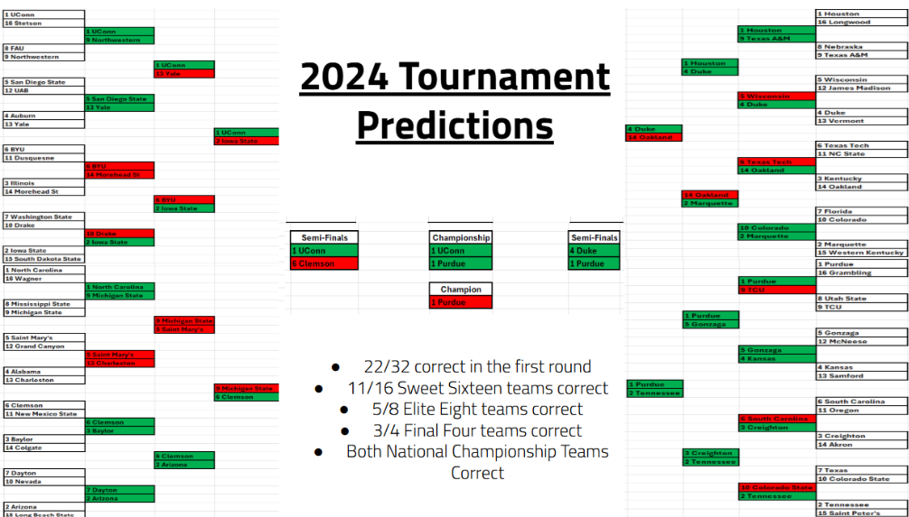
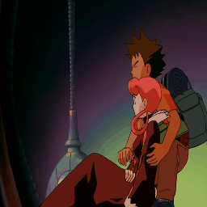

## Projects 

<h4>NBA All-Star Predictor</h4>

Using a scraped data from basketball-reference.com to create machine learning models to predict whether an NBA player makes an all-star nomination based on seasonal statistical performances. The data used is from the 1980-81 season to the 2023-24 season. The model primarily uses to models, decision tree and multi-layer perceptron, to make classify whether a given player profile will be an All-Star.

<a href="https://github.com/neduGit/NBA_All-Star_Predictor" class="button">View Repository</a>

---

<h4>March Madness Predictor</h4>

Using a scraped data from basketball-reference.com to create machine learning model(s) to predict outcomes of matchups within the March Madness Tournament. Uses data from the 2019 season to the 2023 season for training, while using the two most recent seasons (2024, 2025) for testing. The model makes actual predictions, while also producing percentages for the confidence of each prediction. The main model selected is an artificial neural network, which outperformed four other graded models (Logistic Regression, Random Forest, XGBoost, and a Support Vector Classifier).

<a href="https://github.com/neduGit/March-Madness-Predictor" class="button">View Repository</a>

---

<h4>IDS Final Project</h4>

This repository contains our work as consultants for eSC, focusing on predicting future energy consumption and providing insights to enhance energy efficiency. Our current project revolves around forecasting energy usage during the month of July—historically the hottest month of the year—when energy demand is typically at its peak. The goal is to aid eSC in optimizing their power grid usage, reducing the risk of blackouts, and promoting environmentally friendly practices.

<a href="https://github.com/neduGit/IDS_Final_Project" class="button">View Repository</a>

---

<h4>Pokemon Frame Fill-In Project</h4>

A computer vision project designed to generate in-between animation frames from a set of key frames. Given a start frame, an end frame (and optionally intermediate key frames), the model interpolates the missing frames in between reducing the manual labor required of animators and lowering production costs for studios.

<a href="https://github.com/neduGit/Pok-mon-CompVision-Fill-In" class="button">View Repository</a>

---

<h4>NBA Similarity Index</h4>

This project is a Python-based tool that identifies NBA players most similar to a selected player, using a comprehensive set of statistical categories and a cosine similarity algo. It returns a similarity score out of 10 to quantify how alike each player is to the selected target.

<a href="https://github.com/neduGit/NBA-Similarity-Index" class="button">View Repository</a>

